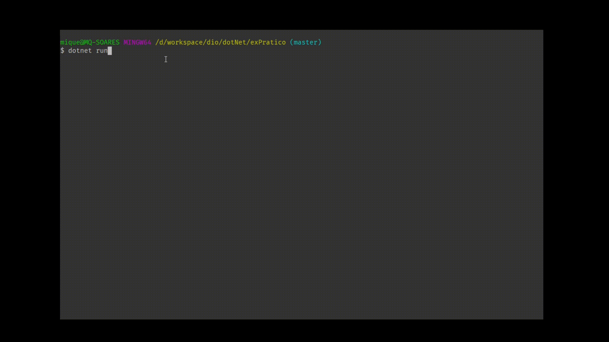

# bootcamp-GFT-.NET

Me aventurando um pouco para entender o funcionamento do .NET para aplicações de Back-end.

- Primeiro contato com a plataforma .NET e linguagem C#.

## exPratico
Foi criado uma Console application para:
- Inserir o nome e nota do aluno em um Array
- Listar os alunos já cadastrados
- Calcular média geral dos alunos
- Sair da aplicação

